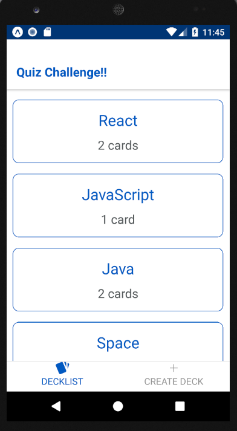
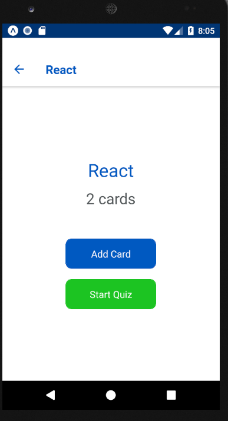
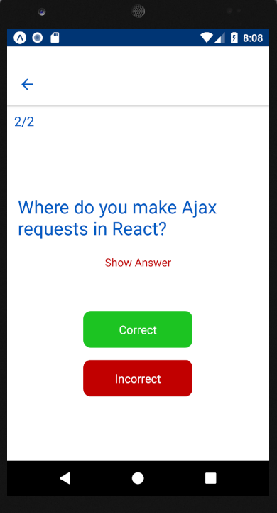
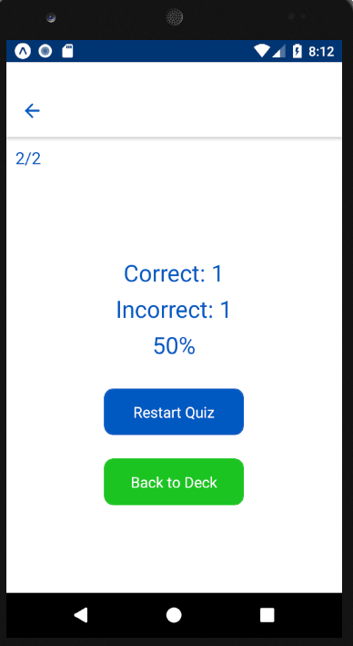
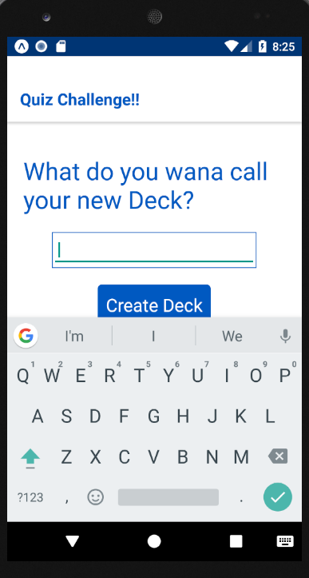
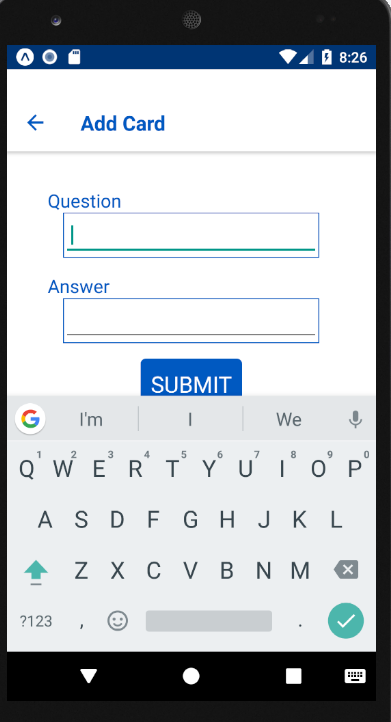

# Mobile Flashcards

React Native project — Udacity React Developer Nanodegree

## About the Project

The project specification is defined by the [Udacity Rubric](https://review.udacity.com/#!/rubrics/1021/view)

## To Install

1. Clone this repo

```
git clone https://github.com/abhijitsamui/mobile-flashcard.git
```

2. Run yarn commands:

```
		yarn install
		yarn start / expo start
```

## Technology Stack

- This project was bootstrapped with Create React Native App.
- Below Tech Stacks have been used for building this project

- [Create React Native App](https://github.com/react-community/create-react-native-app).
- [React](https://reactjs.org/)
- [Redux](https://redux.js.org/)
- [React Native](https://facebook.github.io/react-native/)
- [React Navigation](https://reactnavigation.org/)
- [AsyncStorage](https://facebook.github.io/react-native/docs/asyncstorage.html)

## Testing Platform

The application has been tested using the android emulator (Nexus 5 API 26) only.

## ScreenShots of the APP

Mobile FlashCrad App developed using React Native

### Home Screen

- The primary view, seen when the app loads, is a list of created decks which includes the name of each deck and the number of cards.



### Individual Deck View

The individual deck view includes (at a minimum):

- The deck title
- Number of cards in the deck
- Option to start a quiz for that deck
- Option to add a new question to the deck



### Quiz View

- The Quiz view starts with a question from the selected deck.
- The question is displayed, along with a button to show the answer.
- Pressing the 'Show Answer' button displays the answer.
- Buttons are included to allow the student to mark their guess as 'Correct' or 'Incorrect'
  

### End of Quiz View

- When the last question is answered, a score is displayed. This can be displayed as a percentage of correct answers or just the number of questions answered correctly.
- When the score is displayed, buttons are displayed to either start the quiz over or go back to the Individual Deck view.
- Both the 'Restart Quiz' and 'Back to Deck' buttons route correctly to their respective views.

  

### Create New Deck View

- The view includes a form for creating a new deck - which should just be an input for the title and a 'Create Deck' button.
- Pressing the button correctly creates the deck and routes the user to the Individual Deck view for the new deck.
  

## Create New Quiz Question

- The New Question view includes a form with fields for a question and answer, and a submit button.
- Submitting the form correctly adds the question to the deck.



### Notification & Alert

Logic for notification has been implemented. Notifications are generated at a specific time if the user hasn't completed at least one quiz for that day.

# Acknowledgments

- The course example of UdaciFitness mobile app as part of Udacity's nanodegree programme helped a lot for building this app.
- React Native course from Udemy by Maximilian Schwarzmüller also provide great foundation for building the app.
